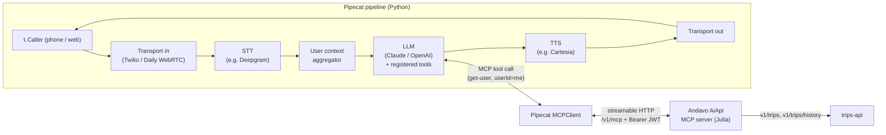

# Pipecat + Andavo — Itinerary Lookup Setup

> Setup notes and reference architecture for the first [[AI Voice Agent]] use case: **call in and ask about my current travel itinerary.** Researched 2026-06-29 against Pipecat docs and the `andavo` repo (`~/repos/andavo/andavo`, main).

## 1. Goal (first use case)

A caller (initially just me) connects by voice and asks something like *"What's my next trip?"* or *"What time is my flight tomorrow?"* The agent authenticates as that traveler, pulls their itinerary from Andavo, and answers conversationally.

This is a **read-only** slice — itinerary retrieval only. Booking/changing comes later.

## 2. The two integration paths

| | **A. MCP client (recommended)** | **B. Direct REST tool calls** |
|---|---|---|
| How | Pipecat's `MCPClient` connects to Andavo's existing **AiApi MCP server** and auto-registers its tools with the LLM | We hand-write Pipecat function tools that call `trips-api` REST endpoints directly |
| Itinerary call | `get-user` tool with `userId="me"` → returns `tripDiscovery` (active/upcoming + recent) | `GET /v1/trips?filter=traveler eq '<email>' and endsAt ge <now>` |
| Pros | Reuses existing, tested tooling; tool schemas + lens/auth logic already done; one call gives user + trips | Full control over payload shaping; no dependency on AiApi being deployed |
| Cons | Depends on AiApi MCP server running + reachable; auth is an OAuth2/Auth0 flow (see §6) | We re-implement auth, filtering, response trimming ourselves |

**Recommendation:** Start with **Path A (MCP)**. The `get-user` tool is almost exactly this use case, and Pipecat's MCP client does the schema/registration work for us. Keep Path B in our pocket as a fallback if AiApi auth proves awkward for a headless agent.

## 3. Reference architecture



Flow: caller speaks → STT transcribes → LLM decides it needs itinerary data → calls the `get-user` MCP tool → AiApi calls `trips-api` → trips come back → LLM phrases an answer → TTS speaks it.

## 4. Andavo side — what already exists

### AiApi MCP server (Julia)
- **Location:** `apps/julia/andavo/AiApi/`
- **Route:** `/v1/mcp` — **local port `9010`** (`libs/client/shared/shared/util/api/src/localPortRouting.ts:18`)
- **Transport:** HTTP — JSON-RPC `POST`, SSE `GET` stream, `DELETE` for sessions (`apps/julia/andavo/AiApi/src/mcp.jl`). This maps to Pipecat's **streamable HTTP** transport.
- **Runs inside** the Roam Julia runtime; session store is in-memory or Redis (`AIAPI_MCP_SESSION_STORE` env: `memory` | `redis`).
- **MCP SDK:** Julia `ModelContextProtocol` package.

**Tools exposed** (`apps/julia/andavo/AiApi/src/tools/`):
| Tool | Purpose | Relevance |
|---|---|---|
| **`get-user`** | Find a user by `userId`/`email`/`name`/`clientId`; returns compact profile **+ trip discovery** | ⭐ This is our itinerary call |
| `search-offers` | Search air/hotel offers (`booking-api POST v1/offers`) | Later (booking) |
| `confirm-booking` | Create/update a trip from selected offers | Later (booking) |
| `booking-context` | Booking context helper | Later |

### The `get-user` tool (our call)
From `apps/julia/andavo/AiApi/src/tools/get-user.jl`:
- **Description:** *"Find a specific Andavo user by userId, email, name, and/or clientId. Returns a compact user profile plus lightweight trip discovery."*
- **Key input:** `userId` accepts the literal **`"me"`** for the authenticated caller — exactly what we want. Also `includeTrips` (default `true`), `tripLimit`, `lens` (`traveler`/`advisor`/`admin`/`internal`, bounded by the caller's authorities).
- **Output `tripDiscovery`:**
  - `activeOrUpcoming` — from `v1/trips`, filter `traveler eq '<email>' and endsAt ge <now>`, sorted `startsAt:asc`
  - `recent` — from `v1/trips/history`, sorted `startsAt:desc`

So a single `get-user(userId="me")` call returns who the caller is **and** their current/upcoming trips. For a "what's my next trip" question, that's a one-shot answer.

### Underlying REST (Path B fallback)
- **`trips-api`** (local port `8007`):
  - `GET /v1/trips` — list trips; rich `filter`/`sort`/`parts` (CORE, SEGMENTS, TRAVELERS, NOTES…)
  - `GET /v1/trips/history` — past trips
  - `GET /v1/trips/{tripId}` — one trip (accepts UID, legacy numeric ID, or 6-char GDS locator); `?parts=` to expand segments
- **Auth:** Auth0 JWT bearer; Auth0 dev domain `https://id.andavo.io`.

## 5. Pipecat side — components needed

Pipecat is an open-source **Python** framework (requires **3.11+**, 3.12+ recommended) for real-time voice agents. A pipeline is an ordered chain of frame processors:

```
transport.input() → STT → user context aggregator → LLM (+tools) → TTS → transport.output() → assistant aggregator
```

Pieces to choose (each is a swappable service, most need an API key):
- **Transport** — for dev: **Daily** (WebRTC, browser mic) or local. For an actual *phone call*: **Twilio** (also Telnyx/Vonage). Recommend starting with Daily/WebRTC to iterate fast, then add Twilio for the real "call in" experience.
- **STT** — e.g. Deepgram.
- **LLM** — Claude (Anthropic) or OpenAI. This is what does tool calling. *(Per org guidance, default to the latest Claude models for our own AI builds.)*
- **TTS** — e.g. Cartesia, ElevenLabs.
- **VAD** — Silero (turn detection), bundled via the `silero` extra.

Install:
```bash
pip install "pipecat-ai[daily,deepgram,anthropic,cartesia,silero,mcp]"
```
(Swap extras for the providers you pick; `twilio` instead of/along with `daily` for telephony.)

### Pipecat ↔ MCP wiring
Pipecat's `MCPClient` (`pipecat.services.mcp_service`) connects to an MCP server and **auto-registers its tools** with the LLM — schema discovery + conversion + registration in one `register_tools(llm)` call. Streamable HTTP supports bearer-token auth headers:

```python
from mcp.client.session_group import StreamableHttpParameters
from pipecat.services.mcp_service import MCPClient

mcp = MCPClient(
    server_params=StreamableHttpParameters(
        url="http://localhost:9010/v1/mcp",
        headers={"Authorization": f"Bearer {ANDAVO_ACCESS_TOKEN}"},
    ),
    tools_filter=["get-user"],   # start with just the itinerary tool
)
tools = await mcp.register_tools(llm)
context = LLMContext(tools=tools)
```

## 6. ⚠️ The auth problem (decide this early)

AiApi is an **OAuth2 facade in front of Auth0** using the **PKCE/authorization-code flow** — i.e. it expects an interactive browser login (`/oauth/authorize` → Auth0 → `/oauth/idp/callback` → `/oauth/token`). A headless voice agent can't click through a browser mid-call. Options:

1. **Prototype shortcut (start here):** manually obtain a dev Auth0 access token for my own account, drop it in an env var (`ANDAVO_ACCESS_TOKEN`), and pass it as the `Bearer` header. Good enough to prove the end-to-end voice→MCP→trips path for *my* itinerary. Tokens expire — fine for a demo.
2. **Per-caller auth (real product):** the caller must be identified and authorized before we can act as them. For phone, that likely means a verification step (e.g. caller ID + PIN, or a pre-issued token tied to the phone number) that exchanges for a scoped token. This is a real design item, not a prototype concern.
3. **Service/least-privilege token:** if AiApi/Roam can issue a narrowly-scoped service token, the agent could look up a traveler by email rather than `"me"`. Needs confirmation that this is supported and acceptable.

**Open question for the team:** what's the sanctioned way for a non-browser client to get a bearer token AiApi will accept? Confirm before building anything beyond the prototype.

## 7. Step-by-step (prototype, Path A)

1. **Repo + Python env**
   - `python3.12 -m venv .venv && source .venv/bin/activate`
   - `pip install "pipecat-ai[daily,deepgram,anthropic,cartesia,silero,mcp]"`
2. **Provider keys** — sign up / pull keys for Daily, Deepgram, Anthropic, Cartesia. Put in `.env` (never commit).
3. **Run Andavo locally** — bring up the Julia `AiApi` so `/v1/mcp` answers on `:9010`, plus `trips-api` (`:8007`) it proxies to. (Confirm the exact `nx`/`bun` run target with the team.)
4. **Get a dev token** — obtain an Auth0 access token for my account; export `ANDAVO_ACCESS_TOKEN` (see §6 option 1).
5. **Smoke-test the MCP server** outside Pipecat — POST a JSON-RPC `tools/list` to `http://localhost:9010/v1/mcp` with the bearer header; confirm `get-user` is listed and `get-user(userId="me")` returns trip discovery.
6. **Build the pipeline** — wire transport → STT → context → LLM → TTS → transport, register MCP tools (§5), give the LLM a system prompt scoped to itinerary Q&A.
7. **Test by voice** — join via Daily, ask "what's my next trip?", verify the LLM calls `get-user` and answers from real data.
8. **(Later) Add Twilio** transport so it's an actual phone call.

## 8. Minimal code skeleton

```python
import os, asyncio
from dotenv import load_dotenv
from mcp.client.session_group import StreamableHttpParameters
from pipecat.services.mcp_service import MCPClient
from pipecat.services.anthropic.llm import AnthropicLLMService
from pipecat.services.deepgram.stt import DeepgramSTTService
from pipecat.services.cartesia.tts import CartesiaTTSService
from pipecat.processors.aggregators.llm_context import LLMContext
from pipecat.processors.aggregators.llm_response_universal import LLMContextAggregatorPair
from pipecat.pipeline.pipeline import Pipeline
from pipecat.pipeline.runner import PipelineRunner
from pipecat.pipeline.task import PipelineTask

load_dotenv()

async def main():
    # transport = DailyTransport(...)  # or Twilio websocket transport for phone
    stt = DeepgramSTTService(api_key=os.getenv("DEEPGRAM_API_KEY"))
    llm = AnthropicLLMService(api_key=os.getenv("ANTHROPIC_API_KEY"),
                              model="claude-opus-4-8")  # use latest Claude
    tts = CartesiaTTSService(api_key=os.getenv("CARTESIA_API_KEY"))

    mcp = MCPClient(
        server_params=StreamableHttpParameters(
            url="http://localhost:9010/v1/mcp",
            headers={"Authorization": f"Bearer {os.getenv('ANDAVO_ACCESS_TOKEN')}"},
        ),
        tools_filter=["get-user"],
    )
    tools = await mcp.register_tools(llm)

    system = ("You are a travel itinerary assistant. When asked about the caller's "
              "trips, call get-user with userId='me' and answer from tripDiscovery. "
              "Be concise and conversational.")
    context = LLMContext(messages=[{"role": "system", "content": system}], tools=tools)
    user_agg, assistant_agg = LLMContextAggregatorPair(context)

    pipeline = Pipeline([
        transport.input(), stt, user_agg, llm, tts, transport.output(), assistant_agg,
    ])
    await PipelineRunner().run(PipelineTask(pipeline))

asyncio.run(main())
```
*Skeleton only — transport setup, exact import paths, and the MCP async-context lifecycle need to be filled in against current Pipecat docs; APIs move fast, so verify versions.*

## 9. Risks / things to verify
- **Auth (§6)** — the single biggest unknown. Resolve the token story first.
- **AiApi deploy/run** — confirm how to run it locally and whether there's a reachable dev/staging instance.
- **Latency** — voice wants <~1.5s round trips; trips-api + MCP hop + LLM tool round-trip needs measuring. Trim `tripLimit` and `parts`.
- **Pipecat API drift** — import paths (`LLMContext`, MCP client) have churned across versions; pin a version and check docs.
- **Data sensitivity** — itineraries are confidential traveler PII. Keep tokens in env/secret store, log minimally, scope `tools_filter` to read-only tools, and don't expand to booking tools until auth is solid.

## 10. Next steps
- [ ] Confirm with team: sanctioned bearer-token path for a headless client (§6).
- [ ] Confirm how to run `AiApi` locally (nx/bun target) + which trips-api instance it hits.
- [ ] Stand up Python env, smoke-test `get-user(userId="me")` over `/v1/mcp` with a dev token.
- [ ] Build the Daily/WebRTC prototype pipeline; demo "what's my next trip?".
- [ ] Then evaluate Twilio for real phone-call transport.

## References
- Pipecat: [Function calling](https://docs.pipecat.ai/pipecat/learn/function-calling) · [MCPClient](https://docs.pipecat.ai/server/utilities/mcp/mcp) · [GitHub / README](https://github.com/pipecat-ai/pipecat) · [API reference](https://reference-server.pipecat.ai/)
- Andavo: `apps/julia/andavo/AiApi/` (MCP server + tools), `apps/java/trips-api/` (itinerary REST), `libs/client/shared/shared/util/api/src/localPortRouting.ts` (local ports)
